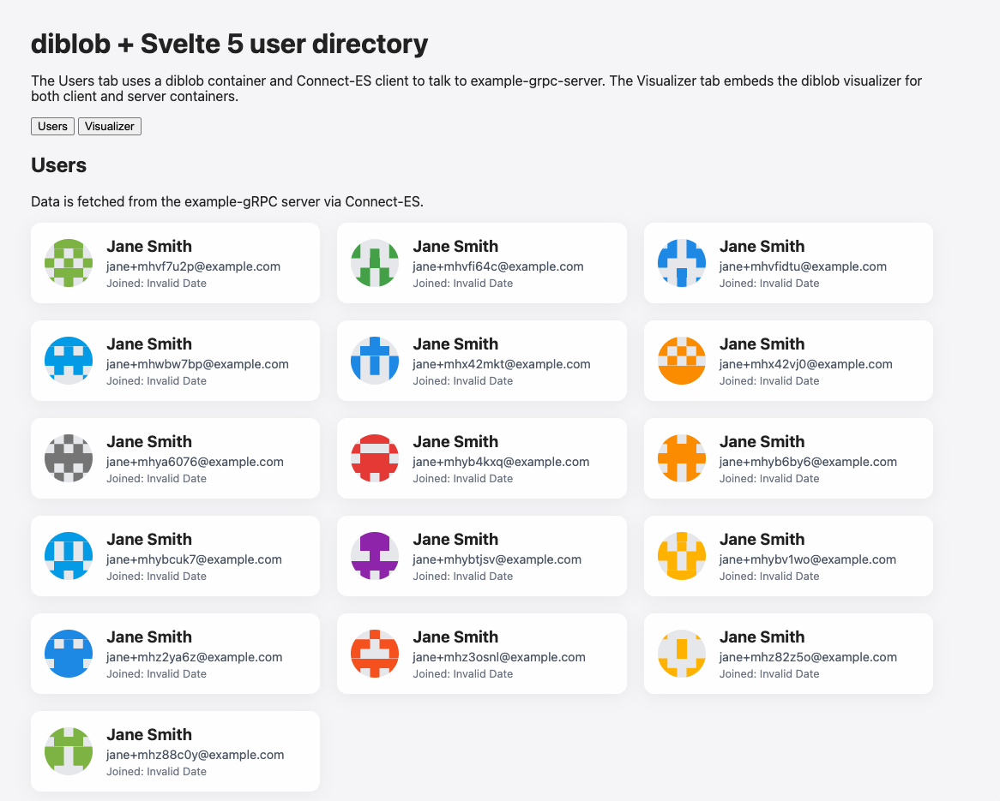
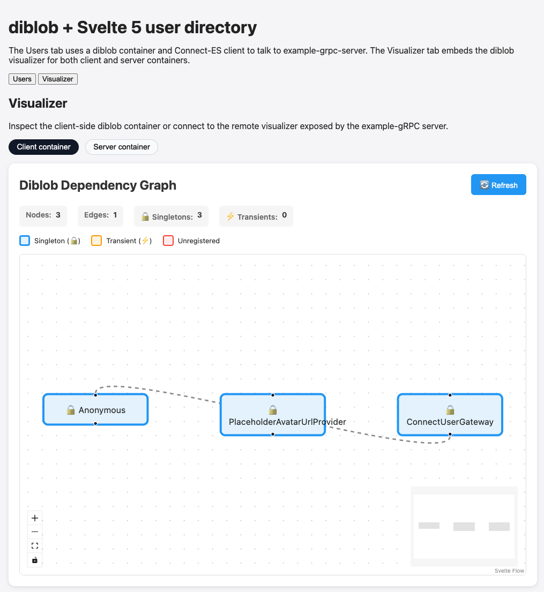

# example-web-svelte

Svelte 5 web client example for **diblob** using:

- `@speajus/diblob` for dependency injection
- `@speajus/diblob-svelte` for Svelte container/context integration
- `@speajus/diblob-visualizer` for visualizing both client and server containers
- `@connectrpc/connect` + `@connectrpc/connect-web` talking to the `example-grpc-server`

This example is intended as a **reference implementation** for using diblob in a modern Svelte 5 app with a remote gRPC/Connect backend.

---

## Screenshots

### Main UI (user list + visualizer tabs)



The main app shows:

- A **Users** tab that lists users returned by the gRPC `UserService`
- A **Visualizer** tab that embeds the diblob visualizer components

### Client container graph



The **client-side** `DiblobVisualizer` shows:

- Application configuration (`exampleWebConfig`)
- The `UserGateway` and its dependencies
- Visual links between blobs and their lifecycle scopes

### Server container graph


The **server-side** `RemoteDiblobVisualizer` connects to the visualizer server started by `example-grpc-server` and renders:

- The gRPC server container (transport, service registry, logger, etc.)
- Drizzle database blobs and the `UserService` implementation

---

## Running the example

From the **repository root** (`diblob`):

1. Install dependencies (once):

   ```bash
   pnpm install
   ```

2. Start the gRPC example server (includes the visualizer server):

   ```bash
   pnpm --filter example-grpc-server dev
   ```

   This starts:

   - Connect/HTTP server on `http://localhost:50051`
  - Visualizer server on `http://localhost:3002` (SSE at `/events`)

3. In another terminal, start the Svelte dev server:

   ```bash
   pnpm --filter example-web-svelte dev
   ```

4. Open the Svelte app (Vite dev server, usually):

   - `http://localhost:5173` (or the port shown in the terminal)

5. Use the tabs in the UI:

   - **Users** – fetches users from `example-grpc-server` over Connect-ES
   - **Visualizer** – shows both the client container and remote server container graphs

---

## How it is wired

- `src/diblob/blobs.ts` – blob definitions for config and `UserGateway`
- `src/diblob/register.ts` – registration function that wires up:
  - `ExampleWebConfig` (API base URL, visualizer URL)
  - `ConnectUserGateway` using `createClient` from `@connectrpc/connect`
- `src/main.ts` – creates a diblob container, registers blobs, and mounts Svelte using `@speajus/diblob-svelte`
- `src/components/UserList.svelte` – uses `useBlob()` to resolve the `UserGateway` and render the user list
- `src/components/VisualizerTab.svelte` – embeds `DiblobVisualizer` and `RemoteDiblobVisualizer`

The example also demonstrates **container lifecycle management**:

- The root container is tied to the Svelte app lifecycle
- When the app unmounts, the container is disposed, cascading disposal to dependent blobs

---

## Related docs

- `docs/grpc/` – gRPC / Connect integration with diblob
- `docs/visualizer/` – diblob visualizer usage and remote visualizer options
- `docs/diblob/examples/` – additional usage patterns for diblob in other environments

